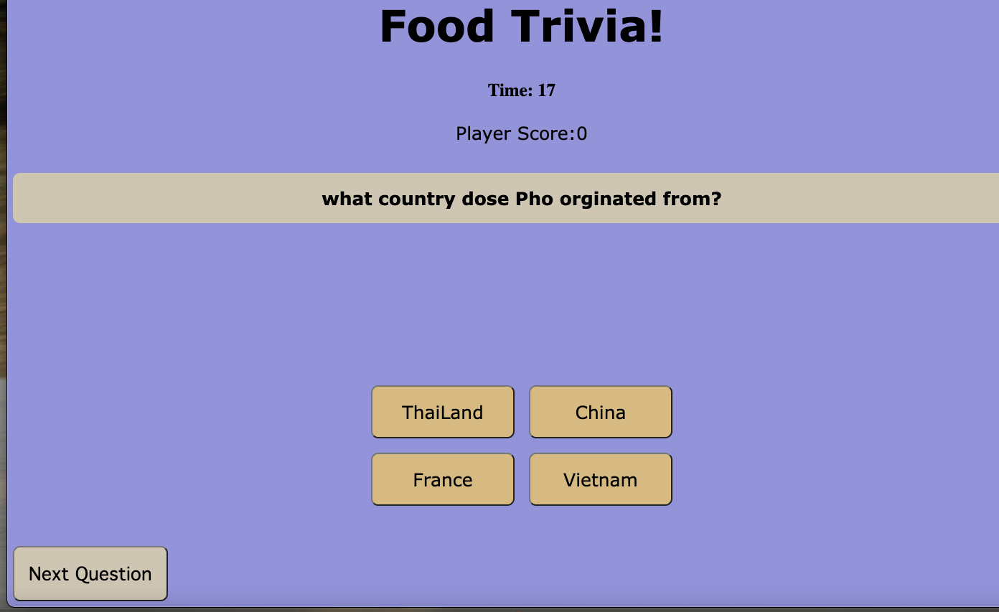

#Project 1 - Food Trivia!

As a player your trying to answer the question correctly before the time runs out. if your able to  correcly answer, you'll recieve 10 points. If answer incorrectly youll lose 10 points. 

#Technologies

HTML
CSS
Dom JS

#Installation instructions 
This is a browers base game so just click on the link below

#WireFrames

#Huddles and problems -
I did have a few issues along the away. some of them included; shuffling the questions, figuring out how to those shuffled questions to the current questions. but the biggest hurdle for me was going back to basic. i was having a issue were my HTML and JS wasnt syncing correctly.